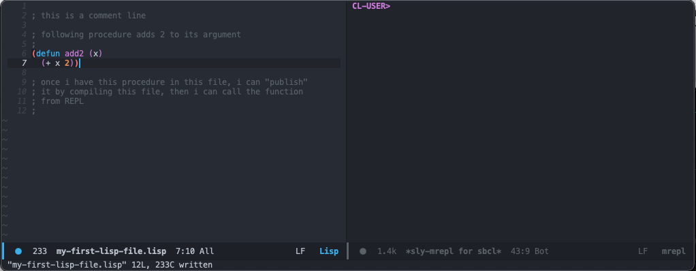
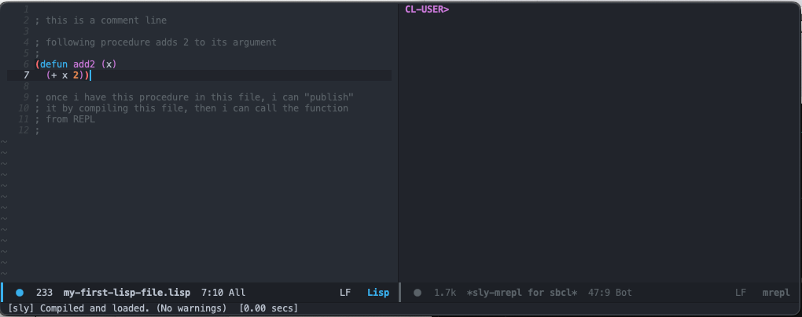
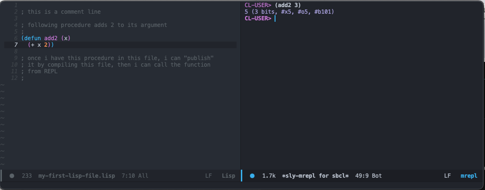

# Programming Environment

We will be using Common Lisp. To write code we need to setup an environment with a suitable editor. You can use any editor you like, but following features are necessary (in decreasing importance):

* highlighting of matching parentheses
* automatic indentation
* syntax highlighting
* electric parenthesization (you only type the opening paren, the other pair is inserted by the editor).
* ability to send selection of code or a single function to SBCL.

As long as you have these, you can use any editor and tool you like.

We suggest EMACS + SLIME. Here's a short guide for the setup.

## Setup for Windows
You can follow installation steps from this [video](https://www.youtube.com/watch?v=VnWVu8VVDbI&t=2s).
The steps are as follows:
1. Go to Emacs download [page](https://ftp.gnu.org/gnu/emacs/windows/emacs-27/)
2. Get emacs-27.2-x86_64-installer.exe (60M) (assuming you have a 64-bit system)
3. Follow installer instructions and finish installing Emacs
4. Download SBCL [here](http://prdownloads.sourceforge.net/sbcl/sbcl-2.2.2-x86-windows-binary.msi)
5. Follow installer instructions
    - If you can't start the installer by double clicking, open a command prompt (windows button + R, type cmd, enter), change directory to installer's path (see [a simple guide](https://www3.ntu.edu.sg/home/ehchua/programming/howto/CMD_Survival.html#:~:text=To%20change%20current%20working%20directory,directory%20under%20the%20current%20drive.) or [powershell commands](https://devblogs.microsoft.com/scripting/table-of-basic-powershell-commands/)), and now you should be able to run the installer
6. Open a terminal window and type sbcl to test if your lisp is working.

You can create a home directory by providing a system variable (a folder path with an alias you can use system-wide). To do so:

7. start -> right click 'computer' -> click 'advanced system settings' -> find the 'environment variables' under 'advanced' -> create new home variable -> variable name HOME, and value is your desired home directory (it can be C:\home)
    - You can view the environment variables from command prompt by typing `echo %Path%` or from PowerShell by typing `echo $Env:Path`
    - For more on environment variables see this [wiki page](https://en.wikipedia.org/wiki/Environment_variable) or [this summary](https://www3.ntu.edu.sg/home/ehchua/programming/howto/Environment_Variables.html#:~:text=2.2%20Set%2FUnset%2FChange%20an,it%20to%20an%20empty%20string.)
    

There is also another system variable called 'Path'. This enables you to run programs using terminal by calling their names. if you find it under system variables and double click it, you can see that there are multiple paths that are in the 'Path', sbcl is automatically added to it, such that you can simply type sbcl to run SBCL from command window. It would be nice to have an emacs version of that, so we'll add the directory where emacs executables are located.

8. Add 'C:\Program Files\Emacs\x86_64\bin' to the 'Path' list.
9. Open a new terminal window and type emacs, you'll have your gui opened. (You need a new command prompt, ones that were open while on step 8 won't work recognise your new `%Path%`)

Now we need MELPA, a package repository for emacs. To be able to use it we need to have an .emacs file in our home directory, with requirements for melpa typed in. This is for initialization of emacs itself. There are multiple directories emacs looks at for [initialization](https://www.gnu.org/software/emacs/manual/html_node/emacs/Init-File.html). We'll use `~/.emacs.d`.

In (vanilla) emacs there are two important keys: C (ctrl) and M (alt). To find (open) a file we use C-x C-f (hold ctrl and press x and f in order). Use C-g to quit if you want to cancel your command.

~ (tilde) symbol is also used for home. We'll find-file ~/.emacs.d

10. Do C-x C-f and type ~/.emacs.d (this may take you to another directory such as c:/Users/username/AppData/Roaming/.emacs.d), and create an initialization file: `init.el`. (Note the difference between ~/.emacs and ~/.emacs.d)
> If your username includes diacritics (or other [forbidden characters](https://stackoverflow.com/a/61448658/3590894)) you may get some error. If you do so, try to change your username or home path.
11. Paste (C-y) the following code into that file (one of those that are valid as initialization files). See this [page](https://melpa.org/#/getting-started) for details. Save (C-x C-s), observe feedback message at the very bottom of the emacs window.
```lisp
(require 'package)

(add-to-list 'package-archives '("melpa" . "https://melpa.org/packages/") t)

(package-initialize)
```
Now we need the changes to get effective, so we can simply quit and restart emacs, or reload settings.

12. Quit Emacs by C-x C-c and restart. Or use M-x load-file and type ~/.emacs or ~/.emacs.d/init.el 13. Hit M-x, and type "package-install", then hit RET (return). You may be asked to connect to elpa and melpa hosts. You can select "always" option if you like. Then you'll be asked the package name (i.e. you'll see `Install package:` at that bottom line). Type slime, and hit RET. This should get you slime. For more info see this [page](https://slime.common-lisp.dev/doc/html/Installation.html).

We need to tell slime which lisp to use.

14. Find your .emacs file again (or your init.el), and add the following line, then save.
```lisp
(setq inferior-lisp-program "sbcl")
```
15. Reload .emacs (M-x load-file ...).
16. M-x slime will get you started.

## Setup for MacOS
1. Install [Homebrew](https://brew.sh).
2. Install sbcl using brew. (See [here](https://formulae.brew.sh/formula/sbcl)).
3. For installing Emacs there are other options, but using Homebrew is ok. See [here](https://www.gnu.org/software/emacs/download.html).
4. Install slime. Follow instructions [here](https://slime.common-lisp.dev/doc/html/Installation.html#Installation).

## Interface Setup
Our aim was to have an editor that helps us write code in lisp language, and an interpreter for those codes. Now that we have both, we can setup the interface. Emacs uses [buffers](https://www.gnu.org/software/emacs/manual/html_node/emacs/Buffers.html) objects for you to interact, and we need two buffers: a lisp file `lisp-file-name.lisp`, and the `slime-repl sbcl`. We'll write code and then use slime [compilation commands](https://slime.common-lisp.dev/doc/html/Compilation.html) to make our procedures available (i.e. callable from sbcl buffer: `CL-USER>`).

Some commands that may be useful:
- `C-g`: quit (cancel typing a command)
- `C-x k`: kill buffer
- `C-x o`: switch to other window
- `C-x 0`: close window (buffer not closed)
- `C-x 2`: `split-window-below`
- `C-x 3`: `split-window-right`
- or do `M-x split-TAB` to see other options listed
- `C-x LEFT` or `C-x RIGHT`: `previous-buffer` or `next-buffer`
- or use `M-x buffer-menu` to see all active buffers 

`M-x slime` uses `split-window-below`, but I like it vertical. So, after starting slime, I close the window (not the buffer) by `C-x 0`, create a new lisp file in a directory that I'd like to keep my lisp files by using `C-x C-f`, save that file. Then, I open a vertical window to the side by `C-x 3`, and change buffer on one of the windows using `M-x buffer-menu` and select `REPL` (i.e. `*slime-repl sbcl*`). Then I go back to the `.lisp` file (`C-x o`) and write some code.

~~~lisp
(defun add2 (x)
  (+ x 2))
~~~

Save the file `C-x C-s`, compile (`C-c C-c` or `M-x slime-compile-defun`), and go to REPL (`C-x o`) to call it with an argument e.g. `(add2 3)`. See screenshots below.



